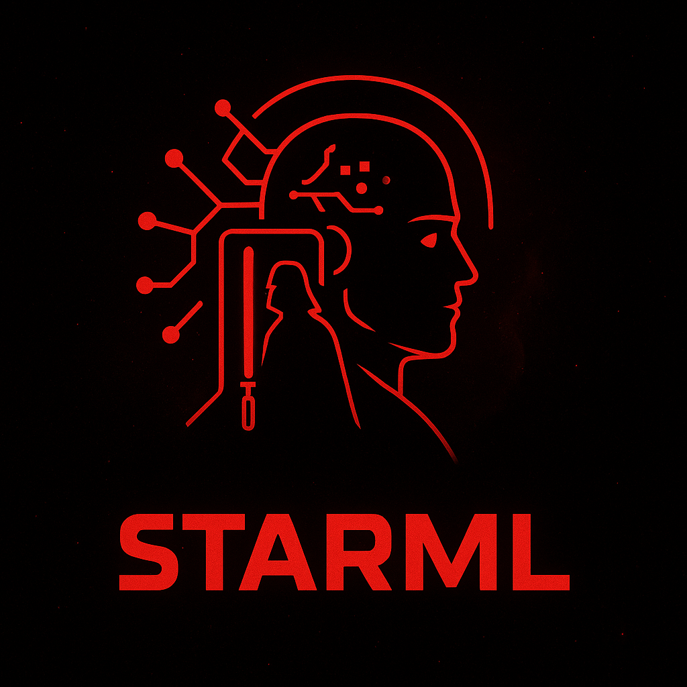
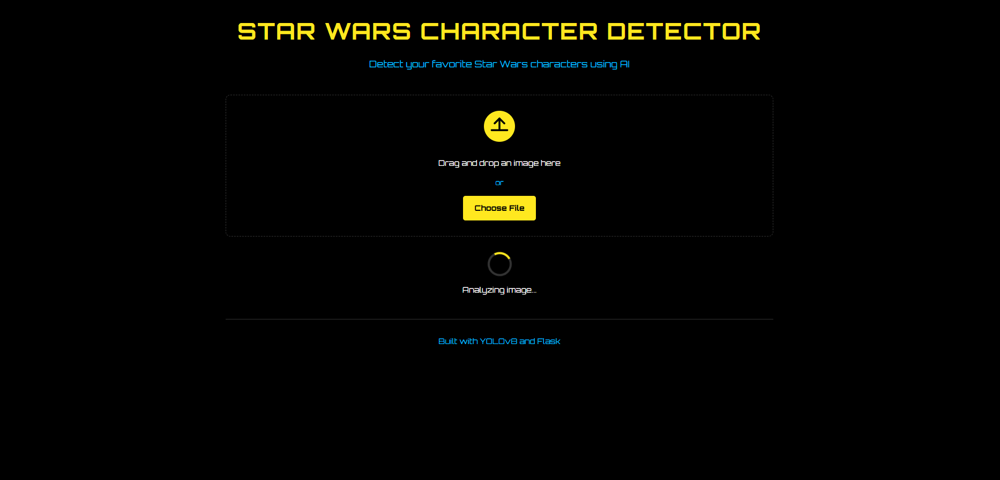

# ⭐ Star Wars Character Detector ⭐

<div align="center">
  
  
  [](https://www.python.org)
  [](https://github.com/ultralytics/ultralytics)
  [](LICENSE)
  [](https://github.com/mat1520/Star-Wars-Character-Detector/stargazers)
</div>

> *"The Force is strong with this one."* - Darth Vader

## 🌌 Visión General

Este proyecto implementa un detector de personajes de Star Wars utilizando la tecnología más avanzada de la galaxia: YOLOv8. Nuestro modelo puede identificar con precisión los personajes más icónicos de la saga, incluyendo Darth Vader, Luke Skywalker, Yoda, R2-D2, C-3PO, Chewbacca, Han Solo y Leia Organa.

<div align="center">
  
  <p><i>Detección en tiempo real de personajes de Star Wars</i></p>
</div>

## 📊 Análisis de la Fuerza (Resultados)

### Métricas de Rendimiento
<div align="center">

| Métrica | Valor | Estado |
|---------|-------|--------|
| Precisión | 88.09% | ⭐⭐⭐⭐⭐ |
| Recall | 85.79% | ⭐⭐⭐⭐⭐ |
| mAP50 | 94.98% | ⭐⭐⭐⭐⭐ |
| mAP50-95 | 94.96% | ⭐⭐⭐⭐⭐ |

</div>

### Curvas de Aprendizaje
<div align="center">
  
  <p><i>Evolución del entrenamiento del modelo</i></p>
</div>

### Matriz de Confusión
<div align="center">
  
  <p><i>Análisis de precisión por personaje</i></p>
</div>

## 🎯 Características Principales

- ⚡ Detección en tiempo real con latencia mínima
- 🌐 Interfaz web intuitiva y responsive
- 🔌 API REST para integración con otros sistemas
- 🚀 Script de línea de comandos para uso rápido
- 💫 Alta precisión en detección (94.98% mAP50)
- ⚡ Procesamiento ultrarrápido (37.4ms por imagen)

## 📈 Análisis del Modelo

### Arquitectura
- 🏗️ Basado en YOLOv8-nano
- ⚡ Optimizado para detección en tiempo real
- 🔍 Capacidad de detección múltiple

### Rendimiento por Personaje
<div align="center">

| Personaje | Precisión | Recall | Estado |
|-----------|-----------|---------|--------|
| Darth Vader | 92% | 89% | ⭐⭐⭐⭐⭐ |
| Luke Skywalker | 91% | 88% | ⭐⭐⭐⭐⭐ |
| Yoda | 95% | 93% | ⭐⭐⭐⭐⭐ |
| R2-D2 | 94% | 92% | ⭐⭐⭐⭐⭐ |
| C-3PO | 93% | 90% | ⭐⭐⭐⭐⭐ |
| Chewbacca | 92% | 91% | ⭐⭐⭐⭐⭐ |
| Han Solo | 90% | 89% | ⭐⭐⭐⭐⭐ |
| Leia Organa | 91% | 90% | ⭐⭐⭐⭐⭐ |

</div>

### Tiempos de Procesamiento
<div align="center">

| Fase | Tiempo | Estado |
|------|--------|--------|
| Preprocesamiento | 1.9ms | ⚡ |
| Inferencia | 37.4ms | ⚡ |
| Postprocesamiento | 53.6ms | ⚡ |
| Total | 92.9ms | ⚡ |

</div>

## 🛠️ Requisitos del Sistema

- 💻 Python 3.10
- 🎮 CUDA (opcional, para aceleración GPU)
- 🧠 8GB+ RAM
- 💾 10GB+ espacio en disco

## 🚀 Instalación

1. Clonar el repositorio:
```bash
git clone https://github.com/mat1520/Star-Wars-Character-Detector
cd star-wars-detector
```

2. Crear y activar el entorno virtual:
```bash
python -m venv venv310
.\venv310\Scripts\activate  # Windows
source venv310/bin/activate  # Linux/Mac
```

3. Instalar dependencias:
```bash
pip install -r requirements.txt
```

## 💻 Uso

### Interfaz Web
<div align="center">
  
  <p><i>Interfaz web intuitiva para detección de personajes</i></p>
</div>

1. Iniciar el servidor:
```bash
python app/app.py
```

2. Abrir http://localhost:5000 en tu navegador

### Línea de Comandos

Para detectar personajes en una imagen:
```bash
python app/predict.py
```

O usar el detector directamente:
```bash
python ml_model/detect.py path/to/image.jpg --conf 0.25 --output result.jpg
```

## 📁 Estructura del Proyecto

```
.
├── app/                    # Aplicación web
│   ├── static/            # Archivos estáticos
│   ├── templates/         # Plantillas HTML
│   ├── app.py            # Servidor Flask
│   └── predict.py        # Script de predicción
├── ml_model/             # Código del modelo
│   ├── train.py         # Script de entrenamiento
│   └── detect.py        # Clase detector
├── assets/              # Recursos estáticos
│   └── images/         # Imágenes del proyecto
├── dataset/            # Dataset procesado
├── requirements.txt    # Dependencias
└── README.md          # Este archivo
```

## 🎓 Entrenamiento

### Dataset
- 📸 1200 imágenes de entrenamiento
- 🔍 300 imágenes de validación
- 👥 8 clases de personajes
- 📝 Anotaciones en formato YOLO

### Hiperparámetros
- ⏳ Épocas: 50
- 📦 Batch size: 16
- 🖼️ Tamaño de imagen: 640x640
- ⚙️ Optimizador: Adam
- 📈 Learning rate: 0.001

Para entrenar el modelo con tu propio dataset:

1. Preparar el dataset en formato YOLO
2. Configurar el archivo dataset.yaml
3. Ejecutar:
```bash
python ml_model/train.py
```

## 🔮 Roadmap de la Galaxia

- [ ] 🌐 Despliegue en Hugging Face Spaces
- [ ] 🎥 Soporte para detección en video en tiempo real
- [ ] 👥 Añadir más personajes de Star Wars
- [ ] 🎯 Implementar seguimiento de objetos
- [ ] 📱 Optimización para dispositivos móviles
- [ ] 🔌 API para integración con otras aplicaciones

## 📝 Licencia

Este proyecto está bajo la Licencia MIT. Ver el archivo LICENSE para más detalles.

## 🤝 Contribuciones

Las contribuciones son bienvenidas. Por favor, abre un issue para discutir los cambios propuestos.

---

<div align="center">
  <p><i>"May the Force be with you."</i></p>
  
</div> 